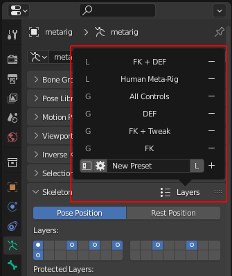

**"Armature Layer Presets"** is an add-on for Blender that allows to save and load custom presets of the bone layer selection for armature. It has a pretty small and compact User Interface designed in a usual to Blender fashion. There is the possibility to save the preset in one of the two types, that is 'local' and 'global'. The first type would be stored into the current blend file and second - to the external json file and could be accessed any time despite of the blend file change.

# Installation

- [**DOWNLOAD LATEST RELEASE**](https://github.com/tingjoybits/Armature_Layer_Presets/releases/latest/download/Armature_Layer_Presets.zip)<- file
- Open Blender and select Edit->Preferences
- Click Add-ons category and then 'Install...' button.
- Select the downloaded archive file from the link.
- Check the 'Armature Layer Presets' option.

